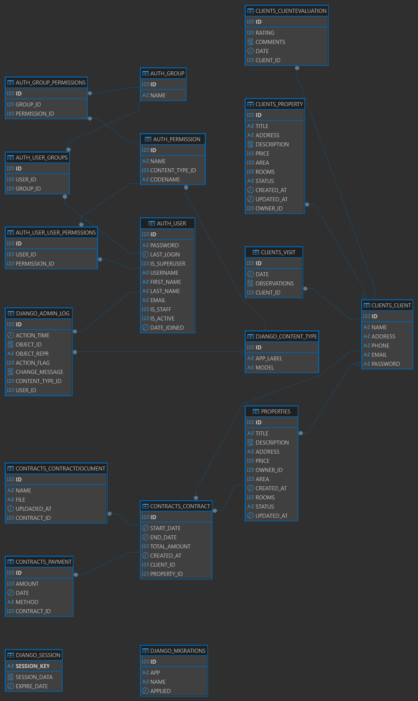

```{r setup, include=FALSE}
knitr::opts_chunk$set(echo = TRUE)
```

📘 SYSTEM DOCUMENTATION - Luxur Management System

1.  Project Information Project Name: Luxur Management System Student
    Name: Samuel Prada Course: Web Development / Systems Engineering
    Semester: 2025-2 Date: November 20, 2025

Short Project Description Luxur Management System is a comprehensive web
application designed to centralize and optimize the management of
clients, properties, and contracts. Built with a modern tech stack
(Django + Angular), the system provides an intuitive interface with
complete CRUD operations, role-based access control, and real-time
validations. It aims to streamline administrative tasks for real estate
or property management businesses.

2.  System Architecture Overview 2.1 Architecture Description The Luxur
    Management System follows a client-server architecture with a clear
    separation between frontend and backend:

Frontend (Client): Single Page Application (SPA) built with Angular 17,
providing a dynamic and responsive user interface Backend (Server):
RESTful API built with Django and Django REST Framework, handling
business logic and data persistence Database: Relational database
(MySQL/PostgreSQL/SQLite) managing all system entities Authentication:
Token-based authentication with session management Communication:
HTTP/HTTPS protocol with JSON data exchange

Architecture Pattern: MVC (Model-View-Controller)

Model: Django ORM models View: Django REST Framework views/viewsets
Controller: Angular components and services

2.2 Technologies Used Frontend:

Angular 17+ (TypeScript framework) PrimeNG (UI component library)
TypeScript 5.x HTML5 / CSS3 RxJS (Reactive programming) Angular Router
(Navigation) HttpClient (API communication)

Backend:

Python 3.10+ Django 4.x (Web framework) Django REST Framework 3.x (API
toolkit) Django CORS Headers (Cross-origin support)

Database Engine:

Primary: MySQL 8.0+ Alternative: PostgreSQL 14+ / SQLite 3

Additional Libraries / Tools:

Git (Version control) npm (Package manager) pip (Python package manager)
Postman (API testing) VS Code (Development IDE)

2.3 Visual Explanation of the System's Operation

3.1 Database Description The system uses a relational database to store
and manage all business entities. The database is designed following
normalization principles (3NF) to ensure data integrity, minimize
redundancy, and optimize query performance. Key Design Principles:

Entity Integrity: Primary keys for all tables Referential Integrity:
Foreign keys with cascading rules Data Validation: Check constraints and
field validations Indexing: Optimized indexes for frequently queried
fields Audit Trail: Creation and modification timestamps

Database Engine Options:

MySQL PostgreSQL SQL Oracle

3.2 ERD – Entity Relationship Diagram
[](login.png)
