```{r setup, include=FALSE}
knitr::opts_chunk$set(echo = TRUE)
```

# 📘 MANUAL DE USUARIO – Sistema de Gestión Luxur

## 📑 Contenido

1.  Introducción\

2.  Objetivo del Sistema\

3.  Características Generales\

4.  Requisitos del Sistema\

5.  Acceso al Sistema (Login)\

6.  Roles del Sistema\

7.  Navegación General\

8.  Módulos del Sistema

    \
    8.1 Clientes\
    8.2 Contratos\
    8.3 Propiedades\

9.  Funcionamiento de los CRUD\

10. Mensajes del Sistema\

11. Validaciones y Reglas de Negocio\

12. Preguntas Frecuentes\

13. Buenas Prácticas de Uso\

14. Soporte Técnico

------------------------------------------------------------------------

## 🧾 Introducción

El presente manual describe el funcionamiento del Sistema de Gestión
Luxur, una plataforma diseñada para administrar información de clientes,
contratos y propiedades mediante una interfaz intuitiva y segura.

El sistema implementa autenticación, control de roles y operaciones CRUD
completas para cada módulo.

------------------------------------------------------------------------

## 🎯 Objetivo del Sistema

Centralizar y optimizar la gestión de registros asociados a clientes,
contratos y propiedades, ofreciendo una herramienta administrativa
robusta, organizada y fácil de usar.

------------------------------------------------------------------------

## 💻 Requisitos del Sistema

-   Node.js 18+
-   Angular 17+
-   PrimeNG instalado
-   Navegador moderno

Backend

Python 3.10+

Django

Django REST Framework

Base de datos (MySQL / PostgreSQL / SQL / Oracle)

## 🛠️ Instalación

### 1. Clonar el Repositorio

``` bash
git clone https://github.com/tu-usuario/sistema-luxur.git
cd sistema-luxur
```

### 2. Configurar el Backend (Django)

``` bash
# Navegar a la carpeta backend
cd backend

# Activar entorno virtual

source .venv/bin/activate

# Instalar dependencias

pip install -r requirements.txt

# Aplicar migraciones

python manage.py migrate

# Ejecutar servidor
python manage.py runserver
```

El backend estará disponible en: `http://localhost:8000`

### 3. Configurar el Frontend (Angular)

``` bash
# Abrir nueva terminal y navegar al frontend
cd frontend

# Instalar dependencias
npm install

# Ejecutar servidor de desarrollo
ng serve --open
```

El frontend se abrirá automáticamente en: `http://localhost:4200`

------------------------------------------------------------------------

🔐 Acceso al Sistema (Login)

El usuario debe iniciar sesión con Usuario y contraseña.

Funciones:

✔ Validación de credenciales

✔Redirección al panel principal

✔ Control de acceso por rol

Login principal

[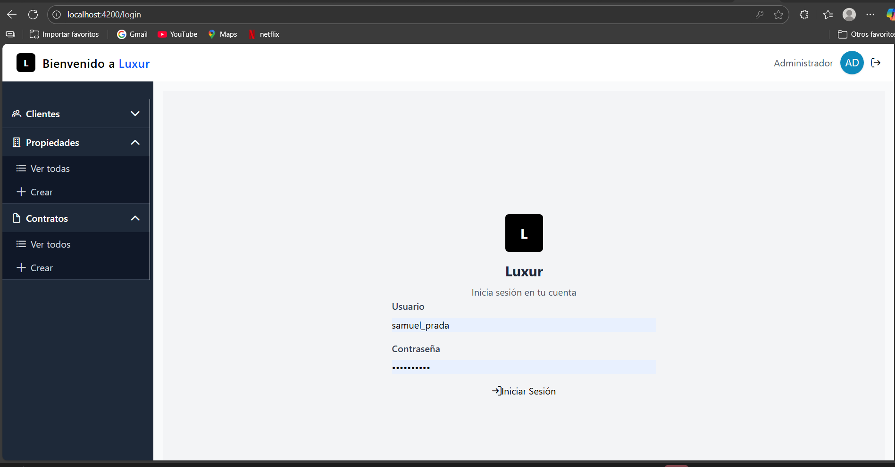](login.png)

Credenciales por defecto:

Usuario: samuel_prada Contraseña: 55959635Sa

🧑‍💼 Roles del Sistema

👨‍💼 Administrador

Accede a todos los módulos

Puede crear, editar y eliminar registros

Gestiona datos críticos

👤 Usuario

Acceso limitado según permisos

Puede visualizar información

Algunas funciones CRUD restringidas

🧭 Navegación General

El sistema presenta un menú lateral con acceso a:

📁 Clientes

📄 Contratos

🏠 Propiedades

🚪 Cerrar sesión

Menu principal

[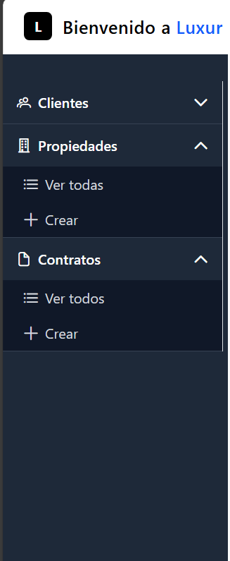](login.png)

🧑‍🤝‍🧑 Clientes

Permite gestionar información de clientes.

Funciones:

Crear cliente

Listar clientes

Editar cliente

Eliminar cliente

Lista clientes

[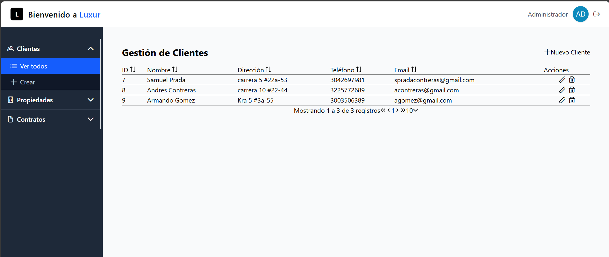](login.png)

🏠 Propiedades

Gestión de propiedades registradas.

Funciones:

Registrar propiedad

Listar propiedades

Editar datos

Eliminar propiedad

Lista propiedades

[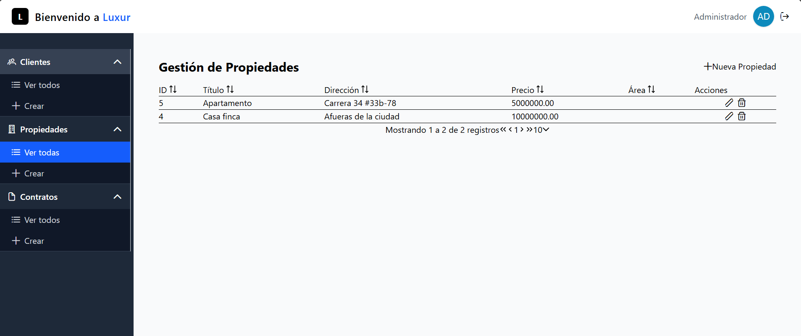](login.png)

📄 Contratos

Permite administrar contratos asociados a un cliente o propiedad.

Funciones:

Crear contrato

Listar contratos

Editar contrato

Eliminar contrato

Lista contratos

[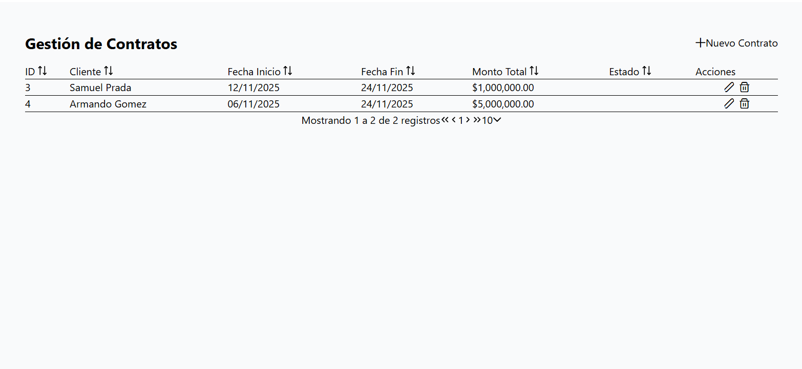](login.png)

🔁 Funcionamiento de los CRUD ➕ Crear registro

Formulario con validaciones

Botón “Guardar”

Confirmación de éxito

CRUD cliente

[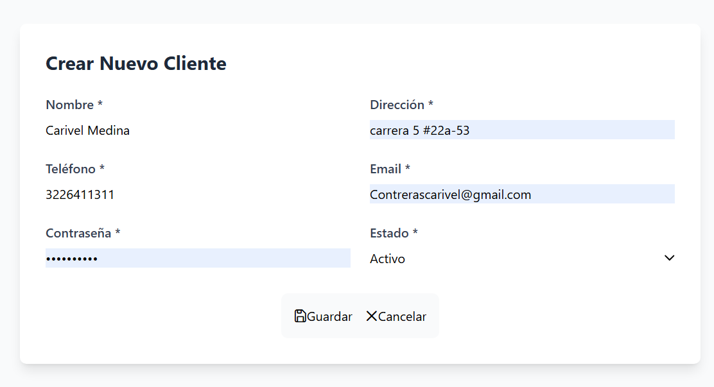](login.png)

CRUD priopiedades

[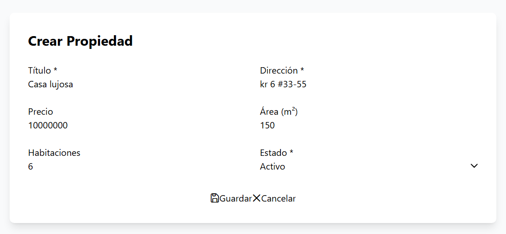](login.png)

CRUD contratos

[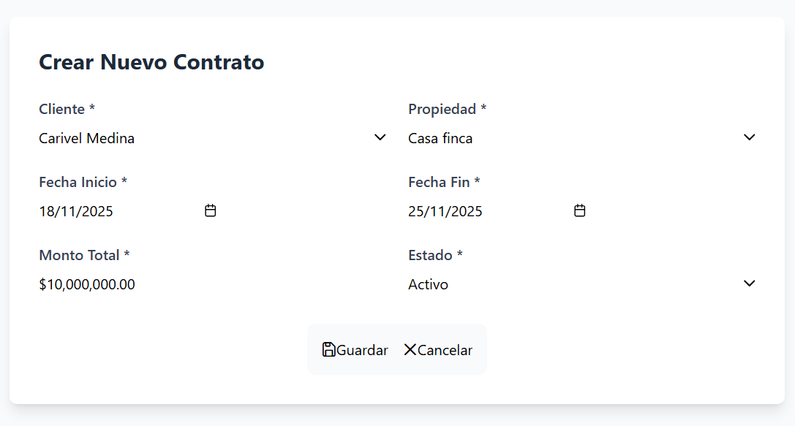](login.png)

✏ Editar registro

Formulario precargado

Botón “Actualizar”

Validación de campos

CRUD clientes

[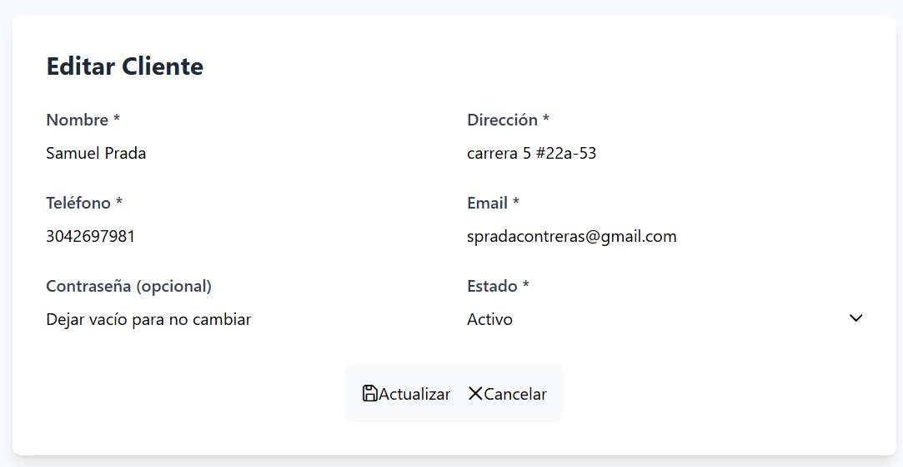](login.png)

CRUD propiedades

[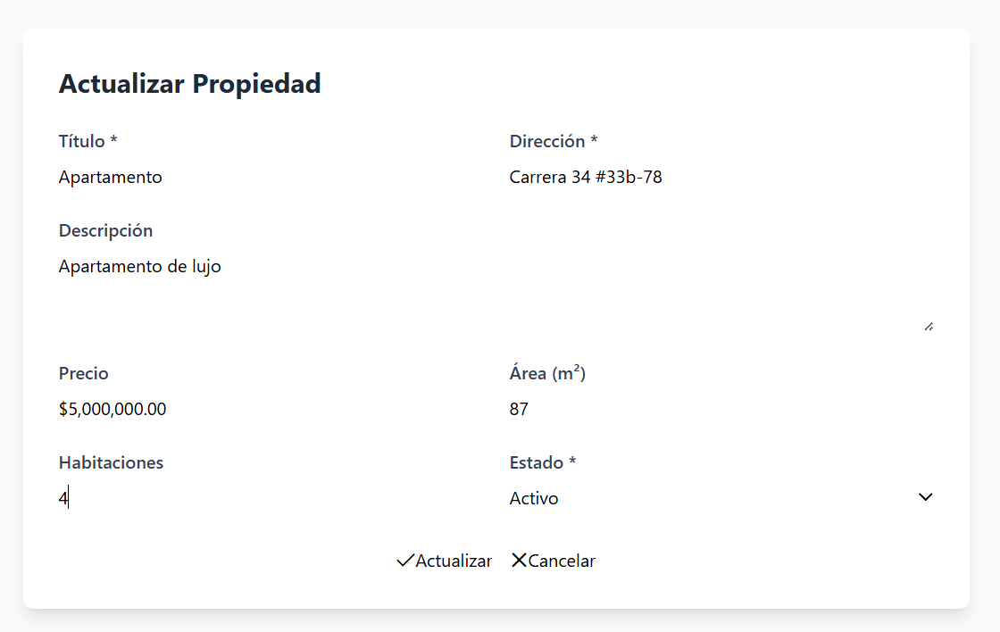](login.png)

CRUD contratos

[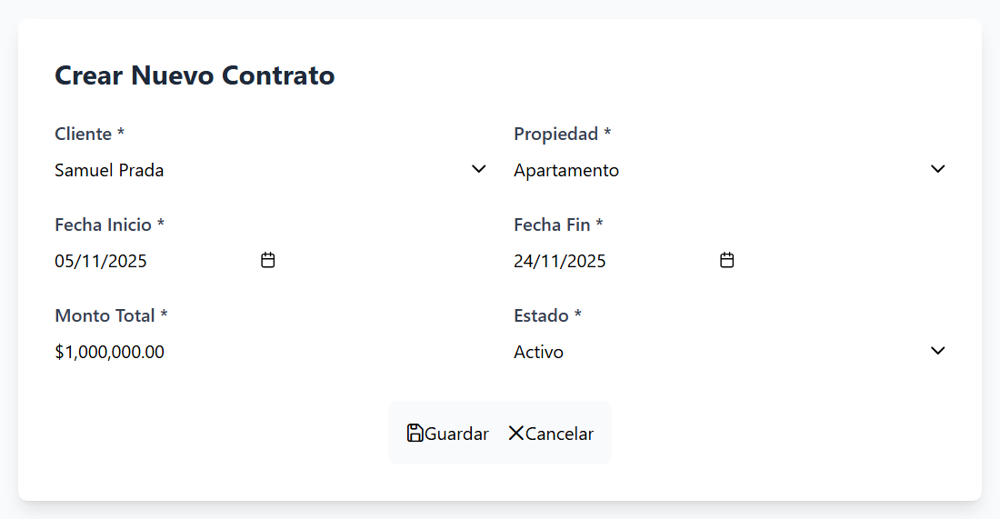](login.png)

🗑Eliminar registro

Confirmación antes de eliminar

Prevención de eliminaciones accidentales

CRUD clientes[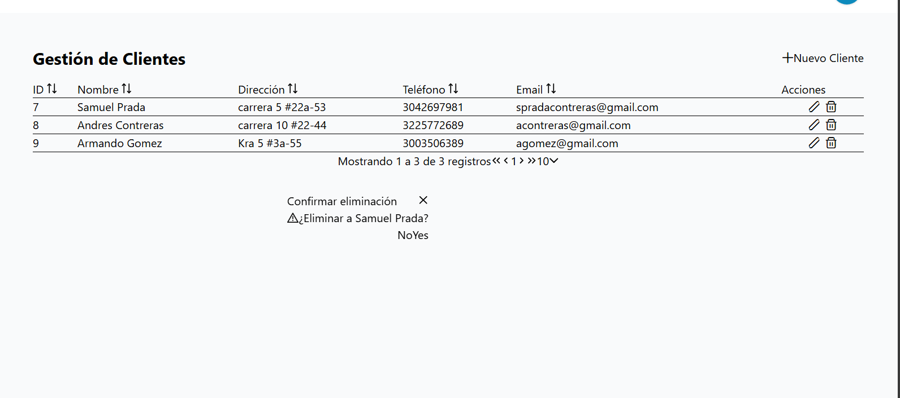](login.png)

CRUD propiedades

[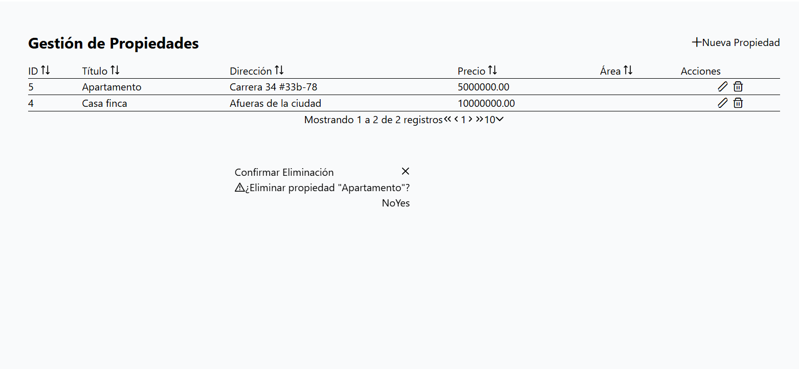](login.png)

CRUD contratos

[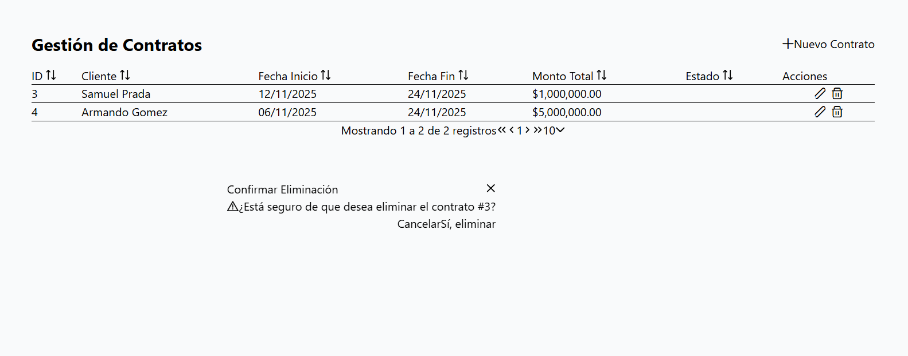](login.png)

🔔 Mensajes del Sistema

✔ Registro creado

✔ Registro actualizado

✔ Registro eliminado

❌Errordel servidor

❌Validaciones fallidas

📏 Validaciones y Reglas de Negocio

Campos obligatorios completos

Correos válidos

CRUD requiere permisos

Usuario debe estar autenticado

API rechaza datos incompletos

## 👨‍💻 Autor

**Desarrollado por Samuel Prada**
